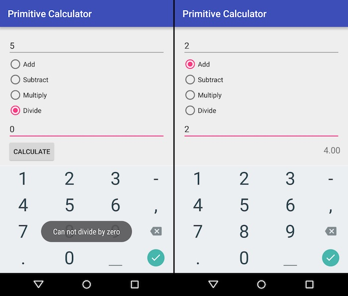

Practice #2
===========

## Task #1: Primitive Calculator

Create a primitive calculator app. The app should contain two input fields for
operand values, four radio boxes to select a mathematical operation (`Add`,
`Subtract`, `Multiply`, and `Divide`), a button to perform calculations, and an
output text field to show results.

UI Widgets that you need to use

* `EditText`
* `RadioGroup` and `RadioButton`
* `Button`
* `TextView`

Set `InputType` for `EditText` field to `numberDecimal`.

Check for invalid input data or attempts to divide by zero. Show `Toast`
popups with user-friendly error messages for such cases.

Limit your main application activity to only work in portrait screen
orientations.

Round results of calculations to two decimal places.

## Task #2: Event Listeners

Remove the button. Make your app to automatically recalculate results for
changes to input fields or radio boxes' selection.

## Reading

### From C# to Java

* [Languages Side-by-side](http://hyperpolyglot.org/cpp)

### Android Documentation

* [App Fundamentals](http://developer.android.com/guide/components/fundamentals.html)
* [UI Overview](http://developer.android.com/guide/topics/ui/overview.html)
* [Input Controls](http://developer.android.com/guide/topics/ui/controls.html)
* [Input Events](http://developer.android.com/guide/topics/ui/ui-events.html)
* [Toasts](http://developer.android.com/guide/topics/ui/notifiers/toasts.html)
