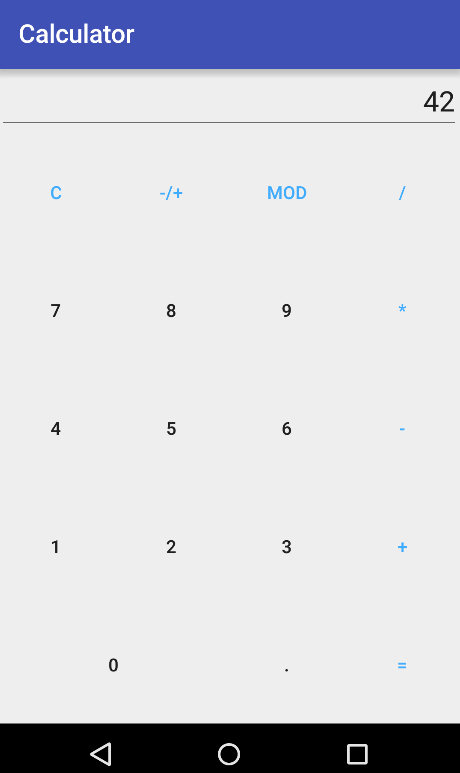

Practice #3
===========

## Task #1: Calculator

Create a calculator app. The app should contain a number pad, one text field to
preview operand values and show results, and buttons for basic mathematical
operations (`+`, `-`, `*`, `/`, `MOD`, `+/-`). The app should imitate a simple
electronic calculator.

UI Widgets that you need to use

* `EditText` or `TextView`
* `Button`

Try to use the `TableLayout` to position UI widgets.

Set `InputType` for `EditText` field to `numberDecimal`.

Check for attempts to divide by zero. Show `Toast` popups with user-friendly
error messages for such cases.

Your app should work in any orientation.

Round results of calculations to ~10 decimal places.

## Reading

### From C# to Java

* [Languages Side-by-side](http://hyperpolyglot.org/cpp)

### Android Documentation

* [App Fundamentals](http://developer.android.com/guide/components/fundamentals.html)
* [UI Overview](http://developer.android.com/guide/topics/ui/overview.html)
* [Input Controls](http://developer.android.com/guide/topics/ui/controls.html)
* [Input Events](http://developer.android.com/guide/topics/ui/ui-events.html)
* [Toasts](http://developer.android.com/guide/topics/ui/notifiers/toasts.html)
* [TableLayout](http://developer.android.com/reference/android/widget/TableLayout.html)

### Java Documentation

* [Stack](https://docs.oracle.com/javase/7/docs/api/java/util/Stack.html)
* [BigDecimal](https://docs.oracle.com/javase/7/docs/api/java/math/BigDecimal.html)
