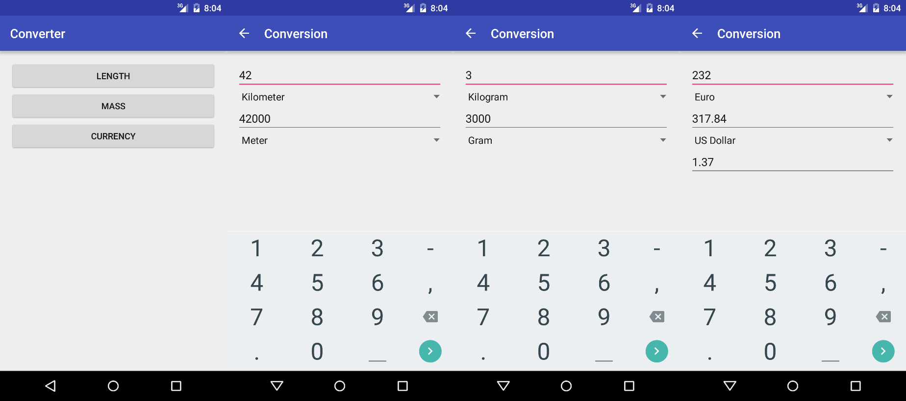

Practice #4
===========

## Task #1: Converter

Create a converter app. The app should allow to convert from one measurement to
another. The app should include at least length, mass, and currency conversion.

The app should contain three separate activities

* Menu
* Unit conversion
* Currency conversion

Use `Intent` objects and the `startActivity` method to switch to another
activities.

UI Widgets that you need to use

* `EditText`
* `Button`
* `Spinner`

Try to use JSON (`JSONObject`) and XML (`getResources().obtainTypedArray()`) to
store conversion factors and unit/currency names.

Use `SharedPreferences` to load and save the state of the app (specifically
values from all input fields).

Find out how to get access to files from the `raw` group under `res` with the
`getResources().openRawResource(...)` call.

You can leave the `RelativeLayout` to position UI widgets.

## Reading

### From C# to Java

* [Languages Side-by-side](http://hyperpolyglot.org/cpp)

### Android Documentation

* [App Fundamentals](http://developer.android.com/guide/components/fundamentals.html)
* [Intents and Intent Filters](http://developer.android.com/guide/components/intents-filters.html)
* [App Resources](http://developer.android.com/guide/topics/resources/providing-resources.html)
* [Storage Options](http://developer.android.com/guide/topics/data/data-storage.html)
* [UI Overview](http://developer.android.com/guide/topics/ui/overview.html)
* [Input Controls](http://developer.android.com/guide/topics/ui/controls.html)
* [Input Events](http://developer.android.com/guide/topics/ui/ui-events.html)
* [RelativeLayout](http://developer.android.com/guide/topics/ui/layout/relative.html)
* [Spinners](http://developer.android.com/guide/topics/ui/controls/spinner.html)
* [Styles and Themes](http://developer.android.com/guide/topics/ui/themes.html)
* [JSONObject](http://developer.android.com/reference/org/json/JSONObject.html)

### Java Documentation

* [Basic I/O](https://docs.oracle.com/javase/tutorial/essential/io/)

### JSON

* [JSON](http://www.json.org)
